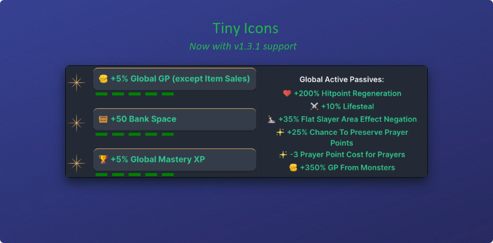
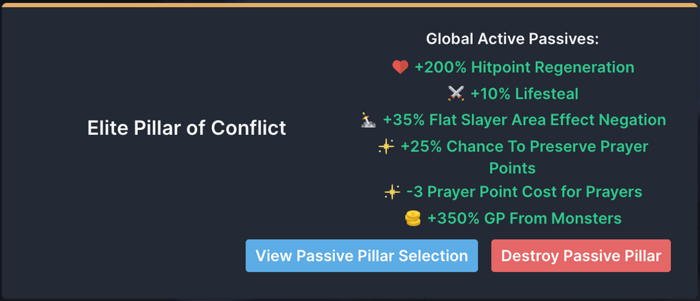
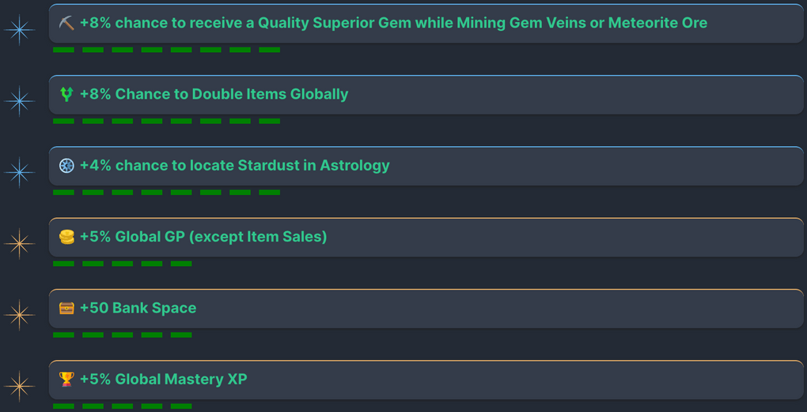
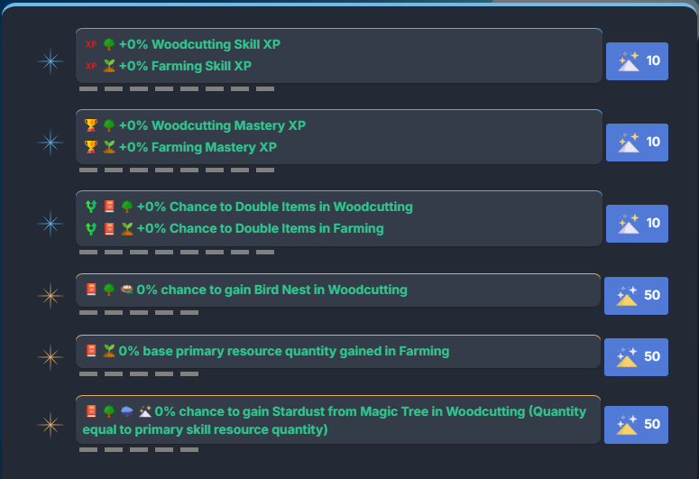
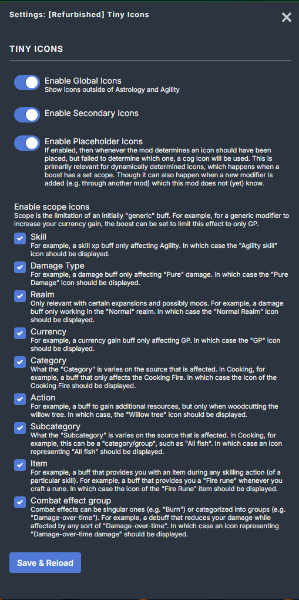

# Tiny Icons

A Melvor Idle mod on [Mod.io](https://mod.io/g/melvoridle/m/refurbished-tiny-icons). Forked from the original [Tiny Icons](https://mod.io/g/melvoridle/m/tiny-icons) mod.

This mod adds tiny icons to modifiers displayed throughout the game. Every modifier in the game is associated with 1-2 static icons and may add additional icons for so called "scopes" (see screenshot with mod seetings down below). Those icons are prepended to the modifier description in many interfaces.

<h2 align="center">

</h2>